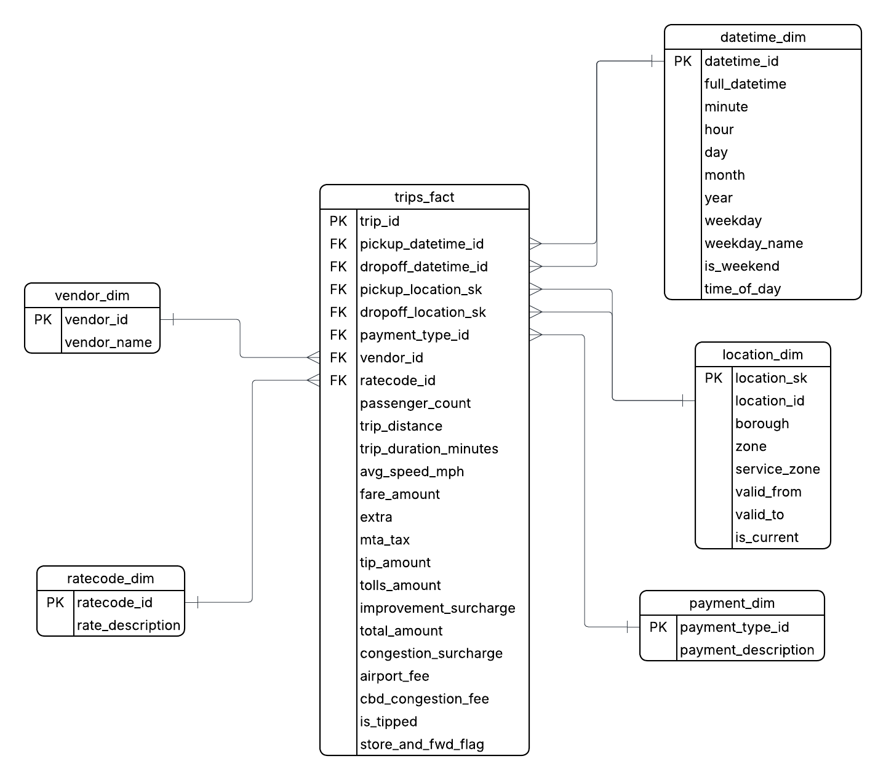

# NYC Taxi ETL Pipeline

This project implements an end-to-end ETL pipeline that processes NYC taxi trip data and loads it into a PostgreSQL data warehouse using a star schema design.

## Overview

The pipeline extracts raw trip data, applies data cleaning and transformations, and loads it into a structured schema using fact and dimension tables.
## Data Model (Star Schema)

## Pipeline Flow

1. Extract raw parquet files (monthly NYC taxi data)
2. Load data in chunks using Pandas
3. Clean and transform data (null handling, metrics, business rules)
4. Build dimension tables (datetime, vendor, location)
5. Apply SCD Type 2 for location dimension
6. Map surrogate keys
7. Load fact table into PostgreSQL

## Performance Considerations

* Chunk-based processing prevents memory overload when handling large datasets
* Incremental loading avoids reprocessing existing data
* Batch inserts improve database write performance

## Features

* Chunk-based processing for large datasets
* Data cleaning and validation
* Star schema design (fact & dimensions)
* Surrogate key mapping
* Slowly Changing Dimension (SCD Type 2)

## Tech Stack

* Python (Pandas)
* PostgreSQL
* SQLAlchemy

## Data Source

NYC Taxi Trip Data:
https://www.nyc.gov/site/tlc/about/tlc-trip-record-data.page

This dataset contains detailed trip records including pickup/dropoff times, locations, fares, and passenger counts.

## Project Structure

* `src/` → ETL logic (extract, transform, load)
* `sql/` → schema creation
* `requirements.txt` → dependencies

## How to Run

1. Install dependencies:
   pip install -r requirements.txt

2. Setup database:
   python src/setup_schema.py

3. Run pipeline:
   python src/main.py

## Key Concepts Demonstrated

* ETL pipeline design
* Data warehousing (star schema)
* Slowly Changing Dimensions (SCD Type 2)
* Surrogate keys
* Handling large-scale data
